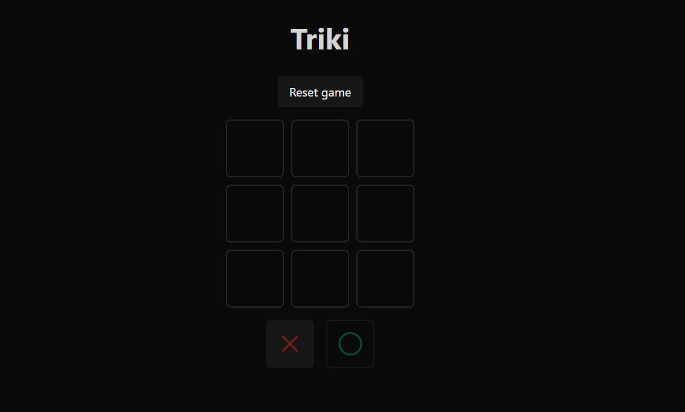

# Triki

Esto solo lo hice para practicar TypyScript, fue un poco complicado el tema de los tipos pero creo que la primera vez de ts siempre es asi, hice el tic tac toe de midudev, pero llamandolo triki como en mi pais, es un proyecto sencillo la verdad, pero complejo para mi y más en typescript. Pero se pudo :)
> 👷‍♂️ Sigue en desarrollo constante.
> 

## Live demo

> [Acá está, igual anda en constante actualización](https://yesidexe.github.io/Triki/)
> 

## **Tecnologias/recursos**

- [React](https://react.dev/)
- [Heroicons](https://heroicons.com/) (icon library)
- [Vitejs](https://vitejs.dev/) (con Css-modules)
- [TypeScript](https://www.typescriptlang.org/)

## Caracteristicas

- [x]  Responsive layout (mobile/tablet/desktop)
- [x]  Local Storage

## Imagen del proyecto

